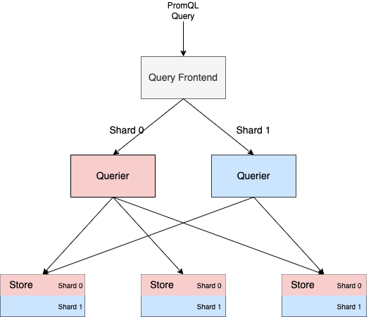

## 为什么需要 Sharding
当前 Thanos 的查询执行模型在处理大体量查询时扩展性较差。因此，我们提出一种查询分片算法，用于将查询执行分布到多个 Thanos Querier 实例上。该算法按时间序列（series）对查询进行分片（即垂直分片），与 Query Frontend 中实现的按时间范围进行的水平分片操作互为补充。

尽管水平分片对于分发持续时间较长的查询（如 12 小时或更长）很有用，但高基数的指标即便在短时间范围的查询中也可能导致性能问题。垂直查询分片将大型查询拆分为彼此不重叠的数据集，可并行地检索和处理，从而减少对大型单节点 Querier 的依赖，并使我们能够在读取路径上实现更高效的任务调度。

### 当前方案的缺陷

在执行 PromQL 查询时，Querier 会从其所有下游的 Store 实例中拉取相关的时间序列数据加载到内存中，并将这些数据传递给 Prometheus 查询引擎处理。

当查询涉及大量时间序列时，这一过程可能会导致 Querier 占用大量内存。结果是，即便系统中存在多个 Querier 实例，查询任务仍会集中在某一个 Querier 上，无法轻松实现负载分担。

### 目标（Goals）

* **必须** 支持将聚合表达式在 N 个查询之间进行分片，其中 N 是用户提供的分片因子。
* **必须** 在查询路径中遇到不可分片的查询或 Querier 时，自动回退为单个查询执行。
* **可以** 作为构建通用查询分片框架的动因，使其适用于任意类型的查询。
* **不应** 对当前的查询请求路径做出任何修改（即 Querier 中查询调度方式保持不变）。

### 适用对象（Audience）

适用于运行大规模 Thanos 集群的用户，这些用户希望通过改进读取路径的方式，提升 Thanos 的稳定性。

## 实现方式（How）

### 查询分片算法

该查询分片算法利用 PromQL 表达式中指定的分组标签，可应用于绝大多数基于 `by` 或 `without` 分组的时间序列聚合查询。

为了说明其工作原理，我们以如下 PromQL 查询为例：

```promql
sum by (pod) (memory_usage_bytes)
```

在以下时间序列集合上执行：

```
memory_usage_bytes{pod="prometheus-1", region="eu-1", role="apps"}
memory_usage_bytes{pod="prometheus-1", region="us-1", role="infra"}
memory_usage_bytes{pod="prometheus-2", region="eu-1", role="apps"}
memory_usage_bytes{pod="prometheus-2", region="us-1", role="infra"}
```

该查询会对每个 `pod` 进行求和，相当于以下两个查询结果的并集：

```promql
sum by (pod) (memory_usage_bytes{pod="prometheus-1"})
```

和

```promql
sum by (pod) (memory_usage_bytes{pod="prometheus-2"})
```

因此，我们可以将上述两个查询分别在两个不同的查询分片中并行执行，并在最终将结果拼接后返回给用户。


### 动态时间序列分区（Dynamic series partitioning）

由于 Querier 无法提前得知各个 Store 中存有哪些时间序列，它们无法轻易地将一个聚合操作重写为两个互不重叠的子查询。不过，Querier 可以向 Store 传递一些信息，指示其仅返回与特定选择器匹配的某个分片（shard）内的时间序列。

为实现这一点，每个查询分片会携带以下信息：

* 总的分片数（如 N）
* 当前分片的索引（如第 0 个分片、第 1 个分片）
* 在 PromQL 表达式中提取出的分组标签（grouping labels）

然后，Store 会对每条时间序列的分组标签执行 `hashmod` 操作，只返回那些 `hashmod` 结果等于当前分片编号的时间序列。

以我们前面提到的例子为例，假设总共分成两个分片，唯一的分组标签是 `pod`，那么每条序列的哈希操作如下：

```
# hash(pod=prometheus-1) mod 2 = 8848352764449055670 mod 2 = 0
memory_usage_bytes{pod="prometheus-1", region="eu-1", role="apps"}

# hash(pod=prometheus-1) mod 2 = 8848352764449055670 mod 2 = 0
memory_usage_bytes{pod="prometheus-1", region="us-1", role="apps"}

# hash(pod=prometheus-2) mod 2 = 14949237384223363101 mod 2 = 1
memory_usage_bytes{pod="prometheus-2", region="eu-1", role="apps"}

# hash(pod=prometheus-2) mod 2 = 14949237384223363101 mod 2 = 1
memory_usage_bytes{pod="prometheus-2", region="us-1", role="apps"}
```

因此，前两条序列会分配给第一个查询分片，后两条序列会分配给第二个查询分片。每个 Querier 只会执行属于自己分片的数据子集，最终由分片组件将所有结果合并返回给用户。

之所以可以按分组标签对时间序列进行安全分片，是因为分组聚合操作可以在每个分组标签值的组合上独立执行。在我们的示例中，只要拥有相同 `pod` 标签值的序列都落入同一个分片，就可以安全地进行分片与结果合并。

### 启动分片查询（Initiating sharded queries）

Thanos 的 Query Frontend 组件已经具备非常实用的查询拆分与合并功能，目前主要用于实现基于时间的水平查询分片。为了在不增加用户额外部署负担的前提下，提供更好的使用体验，我们建议在 Query Frontend 中增加一个新的中间件。

这个中间件将在已有的步骤对齐（step-alignment）与时间切片（horizontal time-slicing）之后，执行本文提出的垂直分片算法。这样，用户就可以基于时间已切片的查询结果，再通过垂直分片来控制单个查询的最大复杂度。

用户唯一需要指定的新参数是：**PromQL 聚合操作应该被拆分为多少个垂直分片（shard）**。

将垂直查询分片集成到 Query Frontend（QFE）中还有以下额外好处：

* 能够将分片应用到即时查询（instant query），从而也可扩展支持报警规则和记录规则（alerting 和 recording rules）
* 能够复用现有的缓存实现逻辑
* 在时间范围已被切分之后再进行垂直分片，可以进一步降低每个查询分片的基数（cardinality）

下图展示了这个分片算法从头到尾的工作流程：



⚠️⚠️⚠️ 正常情况下, QFE 无法连接多个 DownStream Source. 因此, 需要一个 Balancer 在 Frontend 与 Querier 之间, 然后 Balancer 将分片请求分发到不同的 Querier 中实现负载均衡. 由于垂直分片使用的是 hashmod, **所以下层 querier 中的数据需要完全一致吧?**

比如:

[ 1, 2, 3, 4] [5, 6, 7, 8]

如果分片为2, 第一个分片返回 index0, 第二个分片返回 index1, [2, 4] [5, 7] 就会少数据. 我这么理解应该对吧?

而且注意观察图, shard1 就是少了中间的数据.


### 缺点与例外情况（Drawbacks & Exceptions）

并非所有查询都可以轻松地进行分片。有一些聚合操作不适合安全地执行分片。在这类情况下，分片器（sharder）应当自动回退，将整个表达式作为一个完整查询来执行。

这类不可安全分片的情况包括：使用 `label_replace` 和 `label_join` 等 PromQL 函数的查询。这些函数在查询执行过程中会动态创建新的标签，而这些标签是在运行时生成的，Store 并不了解它们，因此无法将这些标签纳入匹配序列的分片逻辑中。

> ✅ 注：未来可以通过 PromQL 的解析与转换来增加可分片的查询类型（#TODO）。

---

由于垂直分片是基于时间序列（series）而不是基于时间进行的，对于某个 Store 节点而言，不同 shard 中的大多数指标数据仍然可能位于相同的 block 中。这会导致读取这些 blocks 的开销增加，因为同一个 block 需要被访问 N 次（N 为分片数）。

在我们的查询分片基准测试中发现，虽然 Store Gateway 和 Receiver 所接收到的 `Series` 请求数量明显增加，但总体查询延迟并没有显著上升。

不过我们观察到 Prometheus 中的远程读取（remote-read）延迟出现了上升，原因在于：sidecar 在执行分片前需要先获取全部匹配 series，再进行分片处理，导致对同一条 Series 多次发起远程读取请求。

这一问题在 Prometheus 社区也被提及，并有一个相关提议希望在 Prometheus TSDB 中原生支持 series 分片（参见：[prometheus/prometheus#10420](https://github.com/prometheus/prometheus/issues/10420)）。

---

另一个我们在 Store Gateway 中识别的问题是：分片查询对 postings 和 chunk 查找的影响。

当 Store Gateway 收到 `Series` 请求时，会根据标签匹配器先从缓存中读取 postings，然后合并这些 postings，并决定需要从哪些 block 或 chunk 中读取数据。分片查询可能会引入以下问题：

* 更频繁的索引查找操作；
* 同一个 chunk 被多个 shard 重复下载。

目前我们尚未对此类问题做出系统测量，因此尚不清楚该问题在大规模下的具体影响。

### 后续改进（Further improvements）

未来，Thanos 可以在 TSDB 的压缩（compaction）过程中对数据块（block）进行后台分片，从而进一步优化查询性能。

具体做法是：将每个 block 拆分成多个更小的子 block，并为每个子 block 添加一个唯一的 `shard_id` 标签。这样，Store Gateway 在查询时就可以直接使用这些 `shard_id` 标签来判断所属分片，而不需要在每次查询时对每条时间序列执行 `hashmod` 操作，从而降低运行时的分片开销，提高整体查询效率。

### 替代方案（Alternatives）

#### 1. 查询下推（Query Pushdown）

查询下推是指将整个查询直接下发到最底层的存储节点（leaves）执行，从而绕过查询延迟的主要来源——Store API 的网络 `Select` 调用。这种方式可以显著减少网络开销和中间层计算。

但这种方式**只适用于有限类型的查询**，因为无法保证不同节点中可能重复的时间序列不会被重复统计。在多个 Store 实例之间，series 可能存在重复，若不进行去重，结果将不准确。

**垂直查询分片**是这种理念的自然延伸，它通过确保查询中每个唯一的时间序列只落在一个 Querier 上，解决了去重问题。目前已有相关实现：[thanos-io/thanos#4917](https://github.com/thanos-io/thanos/pull/4917)。

---

#### 2. 扩展的水平分片（Extended Horizontal Sharding）

Thanos 的 Query Frontend 已实现了基于时间范围的水平分片，将一个查询按时间划分为多个子查询。作为垂直分片的替代方案，也可以实现**更细粒度的水平分片**，将查询在更小时间范围上拆分给多个 Querier 处理。

与查询下推不同，水平分片不存在去重准确性问题，因为**重叠时间区间可以被有效地去重**。

但该方法也面临挑战：

* 查询切分需确保边界处的数据不会被多个分片重复统计；
* 不同指标可能有不同的抓取周期，导致时间对齐复杂；
* 相较于通过 label 做 hash 的垂直分片，基于时间的水平分片逻辑更复杂；
* 水平分片**无法解决高基数问题**，它基于样本数量分片，而这些样本通常高度可压缩。

---

#### 3. 实现流式 PromQL 引擎（Streaming PromQL Engine）

垂直查询分片通过将大查询拆解为不相交的数据集并行处理，减少了对大内存单节点 Querier 的需求，也提升了读取路径的任务调度效率。

这是因为 PromQL 目前大多为单线程执行，并且要求在执行前预展开全部 series。

如果 PromQL 本身支持**流式查询执行（Streaming Evaluation）**，那么也可以在单节点内部实现类似的效果 —— 即数据边读边处理、并行运行。这个方向已在 Prometheus 社区提出过：[prometheus/prometheus#7326](https://github.com/prometheus/prometheus/issues/7326)。

